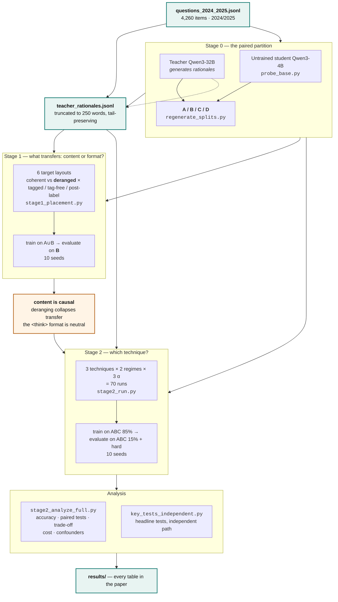

# Reasoning distillation for health professions question answering

Code, data, and analysis for **"[paper title]"** — a study of what actually
transfers when a large teacher's rationales are distilled into a small student,
using Portuguese multiple-choice questions from Brazilian multiprofessional
health residency examinations.

Two questions drive the work, and neither is usually answered in this literature:

1. **Does a rationale's _content_ drive transfer, or only its length and shape?**
   We answer it with a cross-question derangement: each item receives a fluent,
   same-length, same-style rationale that belongs to a *different* question. Only
   relevance is destroyed. If accuracy survives, the rationale was decoration.
2. **Can single-run comparisons identify the right technique?** We answer it by
   running everything over ten seeds with paired per-question tests, and showing
   an effect that a single run cannot see.

Teacher: Qwen3-32B. Student: Qwen3-4B with LoRA. Everything runs on one H100.

---

## Repository layout

```
code/
  data_prep/    build_dataset.py            cut the released dataset
                teacher_parser_fixed.py     audit parser for the teacher's answer
                regenerate_splits.py        rebuild the A/B/C/D partition
                check_teacher_parser.py     divergence report for the two parsers
  stage1/       stage1_placement.py         content vs. format (the derangement study)
  stage2/       stage2_run.py               3 techniques x 2 regimes x 3 alphas
  analysis/     stage2_analyze_full.py      every table in the paper
                key_tests_independent.py    the headline tests, computed independently
                paired_routing.py           selective-routing policies
                cascade_eval.py             cascade routing                      [porting]
                log_confidence.py           answer-confidence logging            [porting]
  probes/       probe_base.py               untrained student, for the partition [porting]
                probe_forgetting_enem.py    catastrophic forgetting on ENEM      [porting]
tests/          test_shuffle_notag.py       the derangement is a true derangement
                test_alpha_cpu.py           masking and alpha weights, CPU-only
data/           the 4,260 released questions and the teacher rationales
results/        the aggregate tables behind the paper's figures
figures/        make_figures.py             renders the paper's figures          [porting]
```

Entries marked `[porting]` are being translated from the original working scripts
and land in a follow-up commit; the numbers they produced are already in
`results/`.

Read it in pipeline order: `data_prep/` produces what `stage1/` consumes, `stage1/`
answers the causal question that motivates `stage2/`, and `analysis/` turns
`stage2/`'s predictions into the paper's tables. Run `tests/` before any GPU job.

---

## The experimental design in one page



Stage 1 exists to earn the right to run Stage 2: if a deranged rationale
transferred as well as a coherent one, no comparison of distillation *techniques*
would mean anything.

**Stage 0 — the paired partition.** Every item is answered by the teacher and by
the *untrained* student. The pair of outcomes defines four strata:

| stratum | teacher | untrained student | what it is |
|---|---|---|---|
| **A** | right | right | already solved |
| **B** | right | **wrong** | **the transfer subset — the thermometer** |
| **C** | wrong | right | teacher noise |
| **D** | wrong | wrong | the hard stratum (stored under the legacy code `H`) |

Subset **B** carries the paper's claims. It is where the teacher knows something
the student does not, so it is the only stratum where transfer can be observed
at all. Aggregate accuracy hides it, which is exactly why the aggregate is the
wrong thermometer.

**Stage 1 — what transfers.** Six target layouts crossed over content
(coherent vs. deranged) and format (inside the native `<think>` span, as plain
body text, or after the label). Trains on A∪B, evaluates on B.

**Stage 2 — which technique.** Three techniques (`pure_sft`, `distill_sft`,
`step_by_step`) × two inference regimes (direct answering, primed reasoning) ×
three loss weights (α ∈ {1.0, 0.3, 0.1}), ten seeds each: 70 runs.

> **The two alphas are different quantities.** For `distill_sft`, α weights the
> rationale **tokens** inside one target. For `step_by_step`, α weights the whole
> rationale **task** — that is Hsieh's λ. Do not read them as one knob.

---

## Reproducing the paper

```bash
pip install -r requirements.txt

# 0. CPU-only self-tests. If any fails, stop: a GPU run would produce
#    numbers that look fine and mean nothing.
python -m pytest tests/ -v

# 1. Stage 1 (six modes x ten seeds)
python code/stage1/stage1_placement.py \
  --think-modes base correct correct_notag correct_after shuffle shuffle_notag \
  --subset AB --eval-subset B \
  --seeds 8 12 17 23 25 31 37 44 52 61 \
  --epochs 2 --token-size 250 \
  --max-seq-length 2048 --max-new-tokens 768 \
  --inference-prompt-style reasoning \
  --train-only-rationale-examples --lora-random-state 3407

# 2. Stage 2 (three techniques x ten seeds, repeated per alpha)
for A in 1.0 0.3 0.1; do
  python code/stage2/stage2_run.py \
    --techniques pure_sft distill_sft step_by_step \
    --seeds 8 12 17 23 25 31 37 44 52 61 --alpha $A
done

# 3. Every table in the paper
python code/analysis/stage2_analyze_full.py --root outputs_stage2
python code/analysis/key_tests_independent.py --root outputs_stage2
```

### Where each claim comes from

| claim in the paper | produced by | table |
|---|---|---|
| content is causal (0.39 → 0.24 tagged, 0.39 → 0.29 tag-free) | Stage 1, `shuffle` vs `correct` | `results/stage1_accuracy.csv` |
| the `<think>` format is neutral (p = 0.91) | Stage 1, `correct` vs `correct_notag` | `results/stage1_accuracy.csv` |
| post-label placement does not replicate (0.324) | Stage 1, `correct_after` | `results/stage1_accuracy.csv` |
| distill-SFT beats step-by-step on B under reasoning (p = 0.025) | `key_tests_independent.py` | `results/key_tests_independent.csv` |
| α repairs the direct-answer deficit | Stage 2, α sweep | `results/paired_tests.csv` |
| reasoning costs ~77× the latency | Stage 2 timing | `results/compute_efficiency.csv` |
| rationale training preserves general reasoning | ENEM probe | `results/forgetting_enem.txt` |

---

## Data

`data/` contains the **complete study population**: all 4,260 items from the
**2024 and 2025** examinations. Earlier years exist in our internal item bank but
were never used in any experiment reported here, so the release is the study, not
a sample of it.

| file | contents |
|---|---|
| `questions_2024_2025.jsonl` | `id`, `source`, `exam_year`, `stem`, `options`, `gold_answer`, `has_image` |
| `teacher_rationales.jsonl` | `id`, `rationale`, `teacher_answer`, `teacher_answer_audit`, `parsers_disagree`, `teacher_correct`, `teacher_correct_audit`, `n_tokens` |

Sources: Enare Residência Médica (2,691), Enare Multiprofissional (1,164),
INEP (287), FUVEST (118). 45 items reference an image; the images themselves are
not redistributed, and those items are handled as text-only throughout (the ENEM
forgetting probe excludes image items explicitly).

The teacher rationales are **model output**, generated by us with Qwen3-32B. They
are the expensive part to regenerate — reproducing them requires running a 32B
model over the whole bank — so releasing them is what makes the distillation
reproducible without that hardware.

See `data/README.md` for provenance, the exact join key, and licensing.

---

## Known deviations between this code and the published numbers

Nothing here changes a conclusion in the paper. They are recorded because a
reader who runs this code should know why a decimal moves.

### 1. Answer extraction

The published numbers were produced by an extractor that took the **first**
`Resposta: X` in a generation. Where the model reasons before answering, a letter
mentioned mid-reasoning could beat its actual conclusion. This release takes the
**last** match.

Measured over the 9,840 archived Stage-1 generations: the two rules disagree on
3.4–5.6% of trained generations, and on those the last match is right 37.0% of
the time against 15.6% for the first. Re-running Stage 1 with this code therefore
gives trained accuracies about **1 pp higher**:

| condition | published | this code |
|---|---|---|
| `correct` (tagged) | 0.390 | 0.398 |
| `correct_notag` (tag-free) | 0.391 | 0.402 |
| `shuffle` | 0.237 | 0.243 |
| `shuffle_notag` | 0.285 | 0.295 |
| `correct_after` (post-label) | 0.324 | 0.321 |
| untrained baseline | 0.439 | 0.439 |

Every conclusion survives: content causality 0.153 → 0.154 (p < 0.001), format
neutrality p = 0.91 → 0.69 (still not detected), the shuffled asymmetry 4.8 → 5.2
points (p = 0.0055 → 0.0015). The old rule was **conservative** — it depressed
the trained conditions and left the untrained baseline untouched.

The same defect existed in Stage 2. Its magnitude there could not be measured,
because the generated text was not retained in the archived Stage-2 inference
files. From the Stage-1 structure the expected effect is ~+1 pp on the reasoning
regime and ~0 on direct answering, which cancels in reasoning-vs-reasoning
comparisons and slightly narrows direct-vs-reasoning gaps.

### 2. Loss normalisation

The published α = 1.0 runs used the stock Hugging Face `Trainer`; the α ≠ 1.0 runs
used the custom `WeightedTrainer`. From transformers 4.46 the stock trainer
consumes `num_items_in_batch` to renormalise under gradient accumulation and the
custom one did not, so the two arms differed subtly in effective normalisation.
This release routes **every** arm through `WeightedTrainer` (with α = 1.0 all
weights are 1.0 and the arithmetic is identical), removing the asymmetry.

### 3. Timing warm-up

The first `generate()` call pays a one-off Triton compilation cost. The published
timings included it; this release discards a warm-up call by default
(`--no-warmup` reproduces the original procedure). Including it inflates the
direct-answer regime — whose total is ~8 s — far more than the reasoning regime
(~600 s), so the published ~77× latency ratio is **conservative**.

---

## Two traps worth knowing before you use this code

**The aggregation trap.** A Stage-1 run name encodes the *full* configuration:
subset, mode, epochs, rationale length, generation ceiling, prompt style, and
seed. Two runs differing only in `mnt` are **different conditions**. In
particular there are two untrained baselines — a *generous* one at `mnt2048` and
a *compute-matched* one at `mnt768` — and pooling them produces a number that
describes nothing. Group by the run name minus `_seedNN`, never by substring.

**Pairing is positional.** Stage-2 inference files carry no item id; questions are
paired by row order, which is valid only because every run reads the same
per-seed split file. The analysis asserts that the gold sequence matches between
any two runs before comparing them, and raises `PAIRING BROKEN` otherwise. Do not
remove that assert — without it, McNemar and the trade-off tables are silently
meaningless.

Two further runtime guards exist for the same reason and should not be removed:
`MASKING BROKEN` (the prompt must be an exact token prefix of the full sequence)
and `DERANGEMENT BROKEN` (no item may receive its own rationale).

---

## Statistical conventions

- The **confirmatory** test is a paired *t* across the ten seed-level accuracies,
  with Wilcoxon signed-rank as sensitivity.
- Intervals are **two-level nonparametric bootstrap**: seeds resampled, then
  questions within seeds, 10,000 replicates.
- Exact within-seed **McNemar** on discordant pairs is an *item-level diagnostic*.
  The `mcnemar_p_min_*` columns are the **minimum p across seeds** — descriptive,
  the best seed, never a global test. They are suffixed `_DESCRIPTIVE` in the
  output so this cannot be misread.
- `stage2_analyze_full.py` enumerates **all** condition pairs and applies **no**
  multiplicity correction, by design. The paper pre-declares four primary
  hypotheses — content causality, format neutrality, technique × regime, and the
  α effect — and treats every other comparison as exploratory.
- Non-significant differences are reported as **not detected**, never as
  equivalence: no equivalence margin was prespecified.

---

## Citation

```bibtex
@article{martinelli2026reasoning,
  title   = {[paper title]},
  author  = {Martinelli, Tiago and Papa, Jo\~ao Paulo and Pereira, Adriano},
  journal = {Artificial Intelligence in Medicine},
  year    = {2026},
  doi     = {[DOI]}
}
```

Archived release: [Zenodo DOI]

## License

Code: MIT (see `LICENSE`). Data: see `data/README.md`.
